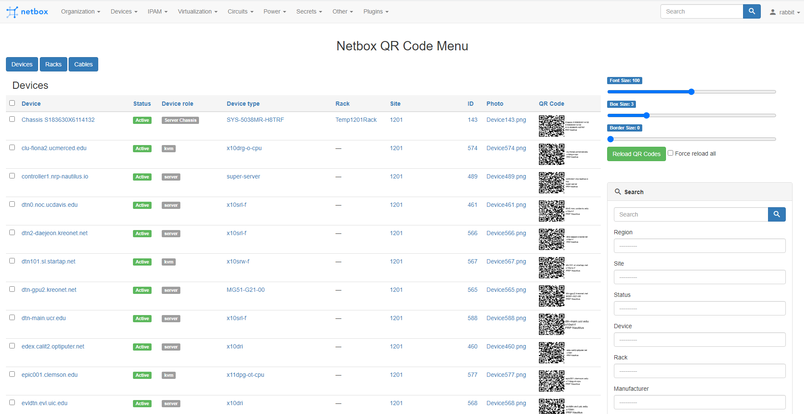
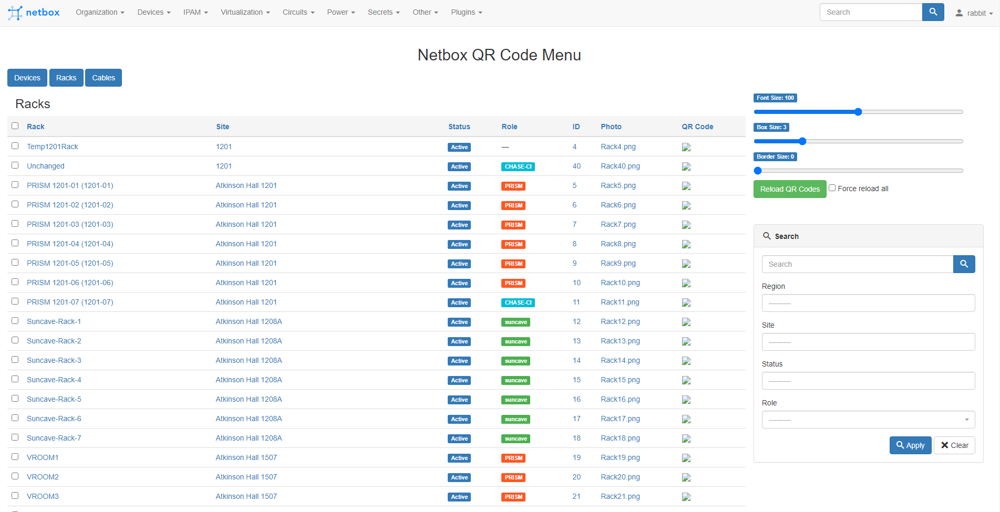
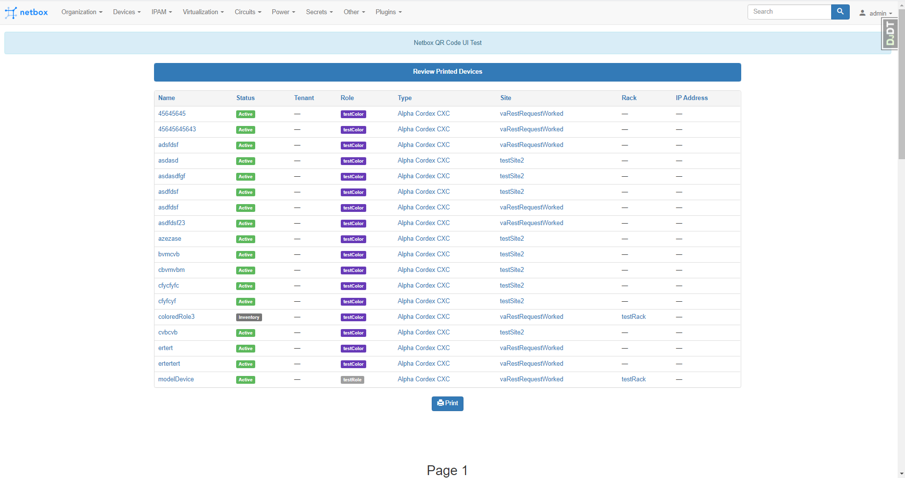
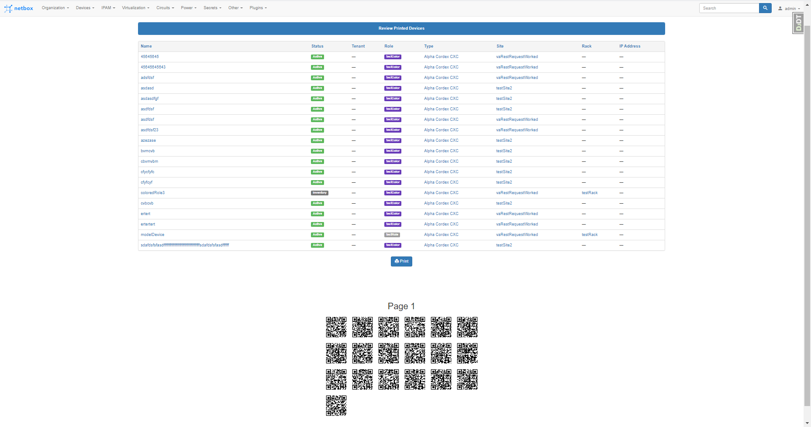

Plugin Code Walkthrough:

https://www.youtube.com/watch?v=dtXzdX3FLoA

# NetBox Plugin Development Guide

A detailed beginner's guide of everything you need to know to get started with NetBox and creating a [NetBox](https://netbox.readthedocs.io/en/stable/) plugin. 

This guide is an aggregate of multiple resources and is adapted from Przemek Rogala's [guide.](https://ttl255.com/developing-netbox-plugin-part-1-setup-and-initial-build/)

## Introduction

NetBox is a open-source IP Address Management (IPAM) and Data Center Infrastructure Management (DCIM) tool. Acting as the source of truth for network related data, NetBox is a powerful management tool that is built using a PostgreSQL backend database and Django Python web framework for its frontend interface and backend API. 

The NetBox API is exposed at `https://<your-NetBox-domain>/api/`. Here you can make various requests to your running NetBox instance. 


## Install the Tools

For Linux users, installation instructions to create a local NetBox instance can be found in this [guide.](https://netbox.readthedocs.io/en/stable/installation/)

The above guide is tested on Ubuntu 20.04 and CentOS 8.2 only. The official NetBox installation guide requires the use of `systemd` commands which belong to specific Linux distro initialization systems. You may find that there is mention of a workaround using `supervisord` which is referenced [here](https://github.com/pobk/netbox-supervisord), but this is not recommended nor tested as `supervisor` is considered a legacy deployment and may not work as intended through new NetBox releases. 

 To check which version and distribution you have, open a linux terminal and run 
```css
$ lsb_release -a
```
 or 
```css
$ uname -r
```  
 To check whether your OS supports `systemd`, run
```css
$ hostnamectl 
```
If the command outputs the following, then `systemd` is not supported : 
``` 
System has not been booted with systemd as init system (PID 1). Can't operate.
```
 
If you on Windows and using WSL (Windows Subsystem for Linux), follow the below instructions to get set up.

## Windows and WSL

### 1. Docker Desktop
If you want to use Docker with Windows and WSL, Docker Desktop is an amazing and easy tool to help you get docker up and running on your system. 

#### Requirements
Ensure that you have Windows 10 64-bit architecture. This can be checked by looked at Settings->System->About in the start menu. 


#### Installation
Install [Docker Desktop for Windows](https://www.docker.com/products/docker-desktop) which will enable the use of all the necessary docker commands and provide a nice interface for starting and accessing our containerized applications. 

WSL 2 is required to complete installing Docker Desktop. Following the Docker Desktop installation if WSL has not yet been installed, a message box will appear after system restart notifying that WSL2 and the Linux kernel update package needs to be enabled. Follow the guide provided by Microsoft to do this [here.](https://docs.microsoft.com/en-us/windows/wsl/install-win10#step-1---enable-the-windows-subsystem-for-linux)


To confirm that Docker is ready for use, run Docker Desktop or to check what version is installed, you can open PowerShell or any terminal/shell of your preference and run:
```css
$ docker version
$ docker-compose version
$ docker run hello-world
```
### 2. Netbox and Docker
Once Docker is up and running, we can utilize an example netbox provided by the netbox-community [here.](https://github.com/netbox-community/netbox-docker)

Navigate to where you want the files to be in your file system and run:
```css
$ git clone -b release https://github.com/netbox-community/netbox-docker.git
```

The application should appear in your Docker Desktop where you are able to start up. For more information in using Docker Desktop, read the official docker [product manual.](https://docs.docker.com/desktop/dashboard/) 

Start the containers by pressing the `Start` button in Docker Desktop. Here, docker will pull and build the netbox-docker image, initialize the necessary worker, postgreSQL, redis and netbox containers, then start up the application.

 Once finished and running, you are now able to open a working local NetBox instance in your webbrowser by clicking `Open in Browser` on the netbox container or pull up a CLI for each of the containers in Docker Desktop by clicking `CLI`. 

 Congrats! You now have a running instance of NetBox to test and work with! 


## Get Started with Plugin Development 

Here we will get set up and learn how to develop a plugin. The official NetBox documentation on developing plugins is outlined [here.](https://netbox.readthedocs.io/en/stable/plugins/development/)

NetBox is built using the Django Framework and the Django template language (DTL). Understanding how the base code of NetBox works and how to extend its code will require some knowledge of the framework. Good resources to check out before developing is the [Django Documentation](https://docs.djangoproject.com/en/3.2/) and NetBox's [open-source repository.](https://github.com/netbox-community/netbox)

A typical file structure of a plugin is layed out below. Note that not all files are required and the structure may be tailored to the plugin's functionalities, however, understanding the purpose of each of the below files may help in the learning of plugin development. 

For other examples of file structures, check out existing NetBox plugins such as:

 * [netbox-plugin-onboarding](https://github.com/networktocode/ntc-netbox-plugin-onboarding)
 * [netbox-qrcode](https://github.com/k01ek/netbox-qrcode)
 * [netbox-bgp](https://github.com/k01ek/netbox-bgp)
 * [netbox-ui-plugin](https://github.com/iDebugAll/nextbox-ui-plugin)

<pre>
|-- plugin_name/
    |-- develop/
        |-- configuration.py
        |-- dev.env
        |-- docker-compose.yml
        |-- Dockerfile
    |-- plugin_name/
        |-- api/
        |-- migrations/
        |-- templates/
            |-- plugin_name/
                |-- example1.html
                |-- example2.html
        |-- __init__.py
        |-- admin.py
        |-- filters.py
        |-- forms.py
        |-- models.py
        |-- navigation.py
        |-- tables.py
        |-- template_content.py
        |-- urls.py
        |-- utilities.py
        |-- views.py
    |-- README.md
    |-- setup.py
</pre>

### 1. Poetry and Invoke (Optional)

You may come across mention of tools such as poetry and invoke for development. These tools are not required but may be helpful. [Poetry](https://python-poetry.org/) is a python dependency and packaging manager. [Invoke](http://www.pyinvoke.org/) is a python task execution tool. 

These tools together can help with things such as starting, building, testing, and migrating though the command line rather through Docker Desktop and in the docker container. Docker Desktop already enables easy access to these functionalities but you may find other usages of invoke to be helpful.  

#### Install Poetry
Detailed installation for poetry can be found [here.](https://python-poetry.org/docs/) For quick referece, open Powershell and run:

```css
$ (Invoke-WebRequest -Uri https://raw.githubusercontent.com/python-poetry/poetry/master/get-poetry.py -UseBasicParsing).Content | python -
```

Check that poetry has been successfully installed with:

```css
$ poetry --version
```
#### Install Invoke

Detailed installation for invoke can be found [here.](http://www.pyinvoke.org/installing.html) For quick referece, open Powershell and run:

```css
$ pip install invoke
```

Check that poetry has been successfully installed with:

```css
$ invoke --version
```

### 2. Set up your plugin

Now that you have all the tools set up in your environment to begin development, let's begin starting a plugin from scratch. 

Start by creating a directory with the name of the format `your-directory-name` by running:
```css
$ mkdir your-directory-name
```

If you have installed and would like to use `poetry` and `invoke`, let's set up the necessary files needed to use the commands. 

Navigate into your new plugin directory by running:
```css
$ cd your-directory-name
```

Active a python virtual environment using `poetry` and initialize.
```css
$ poetry shell
(venv) $ poetry init
```
You will be prompted to fill in information about your package when initializing. The name you enter will be the name of your package and the name used when published to PyPi. Fill in the information and answer "yes" to all questions regarding dependencies. Once complete, you will find a `pyproject.toml` file in your plugin directory. More information on this file is described [here.](https://python-poetry.org/docs/pyproject/)

Create another directory that will be the exposed name of your plugin in NetBox with the format `your_plugin_name` by running:
```css
$ mkdir your_plugin_name
```
This will be the name of your plugin package when installing the plugin into NetBox. Check your file structure to ensure you have something like this:

<pre>
|-- your-directory-name/
    |-- your_plugin_name/
    |-- pyproject.toml
</pre>

Now we need to tell `poetry` to include our plugin when packaging. We do this by adding to the `pyproject.toml` file in the `[tool.poetry]` section a packages list to include in the final distribution. Below is the final result.

```python
[tool.poetry]
name = "your-package-name"
version = "0.1.0"
description = "This is the description you put when running poetry init"
authors = ["Jason Lin <jasonlin1198@gmail.com>"]
packages = [
    { include = "your_plugin_name" },
]
```

Next we add some Python packages as dependencies for our plugin package. These are some libraries used by `tasks.py` needed for `invoke` that we will add in later. 

```css
$ poetry add bandit black invoke pylint pylint-django pydocstyle yamllint --dev
```
These dependencies may be changed depending on your needs and usages. The `--dev` option adds the package as a development dependency. 

You will now find a new file called `poetry.lock` where all dependencies and their versions for your project are detailed. This file essentially locks your project to the specified versions so that other developers and users will have the same version dependencies. During solo developemnt or development using version control, this file should be committed and kept in development to ensure that your project will run with the same dependencies. 

Optionally, you can update your dependencies at any time by running:
```css
$ poetry update
```

Information on all `poetry` commands including the `add`, `shell`, `update`, and `init` commands are listed [here.](https://python-poetry.org/docs/cli/)

Create a `develop/` directory in you project. In this directory, copy over all the files from the `develop/` directory in the netbox-qrcode plugin repo [here.](https://github.com/k01ek/netbox-qrcode/tree/master/develop)

Now let's set up the files if you are using `invoke`. You will need the `tasks.py` file from the netbox-onboarding plugin repo [here.](https://github.com/networktocode/ntc-netbox-plugin-onboarding/blob/develop/tasks.py)

Modify the `tasks.py` and `docker-compose.yml` file to use your plugin name instead. Once done, your file structure should look like the following:

<pre>
|-- your-directory-name/
    |-- develop/
        |-- configuration.py
        |-- dev.env
        |-- docker-compose.yml
        |-- Dockerfile
    |-- your_plugin_name/
    |-- pyproject.toml
    |-- poetry.lock
    |-- tasks.py
</pre>

The `tasks.py` is required by `invoke` and is similar to a `Makefile` and running `make`. If you take a look inside, you will find functions defined with `@task` flags. These are tasks that can be run in the command line using `invoke <task_name>`. Most of these tasks defined involve running `docker-compose` commands which manage the netbox container defined in `/develop/docker-compose.yml`

Finally, the last thing we need to do is include our plugin into the `configuration.py` file which is by NetBox to configure settings about its instance. We can do this by editing the file as shown below:

```python
# Enable installed plugins. Add the name of each plugin to the list.
PLUGINS = ["your_plugin_name"]

# Plugins configuration settings. These settings are used by various plugins that the user may have installed.
# Each key in the dictionary is the name of an installed plugin and its value is a dictionary of settings.
PLUGINS_CONFIG = {'your_plugin_name': {}}
```
Currently, the plugin has not defined any settings to configure so we'll leave its value empty for now. 

You are now done setting up your environment and are ready to construct your plugin!

### 3. Plugin Initialization

In order for a plugin to be recognized by NetBox, the minimum requirement is to have an `__init__.py` file. In general, python packages are defined by having a `__init__.py` file. Subpackages can be defined in the subdirectories of a top-level package. This file defines the configuration of your plugin by inheriting the NetBox PluginConfig class. An example `__init__.py` file is defined below:

```python
from extras.plugins import PluginConfig

class YourPluginConfig(PluginConfig):
    name = 'your_plugin_name'
    verbose_name = 'Verbose Plugin Name'
    description = 'Your plugin description goes here'
    version = '0.0.1'
    author = 'Jason Lin'
    author_email = 'jasonlin1198@gmail.com'
    base_url = 'base-plugin-url'
    required_settings = []
    default_settings = {}

config = YourPluginConfig
```
NetBox looks for the config variable within a plugin's `__init__.py` to load its configuration. More information on additional configurations are found [here](https://netbox.readthedocs.io/en/stable/plugins/development/)


Next, define a `setup.py` file. This script is used to install the plugin package using `pip`. An example `setup.py` file is defined below:

```python
from setuptools import find_packages, setup

setup(
    name='your-package-name',
    version='0.1',
    description='Description of your plugin package',
    url='',
    author='Jason Lin',
    license='Apache 2.0',
    install_requires=[],
    packages=find_packages(),
    include_package_data=True,
    package_data={
        '': ['*.html']
    }
    exclude_package_data={
        '': ["README.txt"]
    },
    zip_safe=False,
)
```
Above you see the keywords used by the [setuptools](https://setuptools.readthedocs.io/en/latest/) library, a library used to package Python projects.  

`install_requires` - list of python dependencies needed to run the project  

`packages` - list of specified packages in your project to include during installation. `find_packages()` will search through all subdirectories and include all packages found. 

`package_data` - dictionary of data files to include when packaging the project. `'': ['*.html']` includes all html files in any of the project packages  

`exclude_package_data` - dictionary of data files to exclude when packaging the project.

`include_package_data=True` - tells setuptools to include all data files found by listed in `packages=find_packages()`. The files must be listed in a `MANIFEST.in` file. Read the documentation for [find_packages()](https://setuptools.readthedocs.io/en/latest/userguide/package_discovery.html) and how [include_package_data](https://setuptools.readthedocs.io/en/latest/userguide/datafiles.html) works. Data files are files such as *.md, *.ttf, *.html, *.css, *.png and other static files. 

Summary: You can use `include_package_data=True` and include a `MANIFEST.in` file and/or specific with more fine grain control of which data files to include during installation with `package_data` and `exclude_package_data`. 

An example `MANIFEST.in` file that includes all HTML files in the `/templates` directory is shown below:

```
#MANIFEST.in
recursive-include your_plugin_name/templates *.html
```

You should now find your file structure to be as such:

<pre>
|-- your-directory-name/
    |-- develop/
        |-- configuration.py
        |-- dev.env
        |-- docker-compose.yml
        |-- Dockerfile
    |-- your_plugin_name/
        |-- __init__.py
    |-- pyproject.toml
    |-- poetry.lock
    |-- MANIFEST.in
    |-- tasks.py
    |-- setup.py
</pre>

You are now ready to start up the NetBox container and checking that your plugin is working. You can do this by opening Docker Desktop, starting the containers, creating a superuser and opening in browser. You can also do this by `invoke` commands. 

For invoke and docker commands run the following:

`$ invoke start` - Starts NetBox and its dependencies

`$ invoke build` - Build all docker images

`$ invoke create-user — user <name>` - Create a new user in django (default: admin), will prompt for password.

If you run into problems with creating an admin user with an error regarding "pty=True" or are using Docker Desktop, run: 

`$ docker exec -it <container_id> python manage.py createsuperuser`

where container_id is the netbox docker container id. This calls the netbox `manage.py` script inside of the netbox docker container to manually create a superuser. Docker container IDs can be found by running `$ docker ps` in your local shell. 

If everything is working, you should be able to see and login into NetBox on you web browser at http://localhost:8000/. 

Verify that the plugin has been installed by checking `admin -> System -> Installed plugins` and see if your plugin name is listed in the table. If not, ensure that your plugin name defined in `setup.py`, `configuration.py`, and `__init__.py` are correct. 


Congratulations! You now have a working plugin running in NetBox! Continue reading below to learn about the components you can add to your plugin.

### 3. Plugin Code

Below we will go through some of the core files used in plugin development and explore their usages with basic examples of each. 

#### Models

`models.py` defines all class models in you plugin. An typical example of a Django model is the native [User Model.](https://docs.djangoproject.com/en/3.2/ref/contrib/auth/) This class is used for django authentication and has fields such as `username`, `first_name`, `last_name`, `email`, and `password`. Each User model can have each of these fields attached to it. Each of these fields can be flagged as optional or required, but nonetheless, a User may have all of these fields. In order for Django to use models, these models and their attached fields must be migrated into the postgreSQL database by running the `migrate` command. What this does is it defines a database schema with the model fields as table columns. 

A visual image of what postgreSQL database models look like is shown here:


An example `models.py` is defined below:

```python
# models.py
from django.db import models

class ExampleModel(models.Model):
    name = models.CharField(
        max_length=64,
        blank=True,
        null=True
    )
```

Models need to inherit from the Django `models.Model` class. In our `ExampleModel` model, we define a field called name that is of type `CharField`. This field has a max length of 64 characters, the field is allowed to be blank, and empty values are set to NULL. 

A list of all supported model fields can be found in the Django Documentation [here.](https://docs.djangoproject.com/en/3.2/ref/models/fields/#django.db.models.Field)

#### Admin

`admin.py` defines all models that are exposed to the admin UI in NetBox. An simple example admin file looks like:

```python
# admin.py

from django.contrib import admin
from .models import YourModelName


@admin.register(YourModelName)
class YourModelNameAdmin(admin.ModelAdmin):
    list_display = ("field1", "field2")
```
Here we import the Django admin class and a custom model that we have created in `models.py` called `YourModelName`. We decorate the `YourModelNameAdmin` class with the @admin.register tag to expose our model in the NetBox admin view. We also add a tuple in the class that allows us to customize which fields of our custom model we want to be shown in the admin view. Not all model fields need to be included. Additionally, this is tuple is optional. If no fields are wanted to be exposed, the class can simply have a `pass` statement as shown below. 

```python
@admin.register(YourModelName)
class YourModelNameAdmin(admin.ModelAdmin):
    pass
```

#### Navigation

```python
# navigation.py

from extras.plugins import PluginMenuItem

menu_items = (
    PluginMenuItem(
        link='plugins:your_plugin_name',
        link_text='The text you want the button to have',
        buttons=()
    ),
)
```

In NetBox, there is a Plugin dropdown that appears when an installed plugin has defined a PluginMenuItem. The greyed out text that appears in the dropdown is the plugin's Verbose name defined in `__init__.py`. The value of link_text is what appears below the greyed out text. 

`link` - Defines the url path that is navigated to when pressed, in the example above it would be `http://<your_netbox_domain>/plugins/your_plugin_name`. This url path needs to be defined in `url.py`. 

`buttons` - Additional optional buttons can be added to the MenuItem which are defined with `PluginMenuButton`.

#### URL dispatcher

To define the routing between URLs in your plugin, we create a URLConf file called `url.py`. This file describes the URL endpoints that the plugin's views and templates use. This file may also be referred to as a router file in other Django resources. An example `url.py` is defined below:

```python
# urls.py

from django.urls import path
from . import views

urlpatterns = [
    path('path_name/', views.ExampleViewName.as_view(), name='custom_view_name'),
]
```

In the code above, we import Django's path function and all views defined in our plugin's `views.py`. We define the `urlpatterns` variable which is a specific variable name that Django looks for in python modules. Learn more about URL dispatchers [here](https://docs.djangoproject.com/en/3.2/ref/urls/#django.urls.path) and the path function [here.](https://docs.djangoproject.com/en/3.2/ref/urls/#django.urls.path) 

For reference, `path()` takes a number of parameters where the function definition is as follows: 
```
path(route, view, kwargs=None, name=None)
```
`route` - url path for the specified view  
`view` - view function that is returned  
`kwargs` - additional arguments passed into the view function (optional)  
`name` - string name used for [URL reversing](https://docs.djangoproject.com/en/3.2/ref/urlresolvers/#django.urls.reverse) (optional)

You can define Django views as both function-based views or class-based views. For usage of class based views, the function `as_view()` is used. More info on views will be detailed in the Views section of this guide. 


#### Views

You can learn about writing views in the Django documentation [here.](https://docs.djangoproject.com/en/3.2/topics/http/views/) Views essentially take a http request and return a reponse. The reponse can be in the form of a http reponse such as a HTML template file defined by your plugin under `/templates/your_plugin_name`. With a class-based view, you can define multiple functions such as get() and post() that will execute upon GET and POST requests on your view. An basic example of a class-based view is shown below:

```python
# views.py

from django.shortcuts import render
from django.views import View

class ExampleView(View):

    template_name = 'your_plugin_name/example.html' 

    def get(self, request):
        return render(
            request,
            self.template_name,
        )
    def post(self, request):
        return render(
            request,
            self.template_name,
        )
```

This example imports the Django `render()` function and defines the class-based view by inheriting the required Django View class. Within the class, we define the path to a HTML file that will be rendered on a GET and POST request. If the view is configured in your `urls.py` file, requesting the url to the route of the view will invoke the `get()` and render the `example.html` file in your browser. This is a very basic overview of views and it is encouraged to read through the Django documentation to learn more about its capabilities. 

#### Templates

Templates are essentially HTML files that follow the Django Template Language (DTL). This is similar to the python Jinja2 template engine but has some differences. Templates are created so that `views.py` can render them when requesting URLs. 

You can find all the templates that NetBox uses in their repository. Many of the templates extend the `base.html` template. This base template creates the NetBox header and footer seen on most of the NetBox web pages. The base template also reserves space for content to be injected by the use of the `` blocks. Wrap the HTML content you want to render within these two blocks to include your content.

A very basic template and view that extends the NetBox base template and adds "Hello World" by use of Django Contexts is shown below:


```python
# views.py

from django.shortcuts import render
from django.views import View

class ExampleView(View):

    template_name = 'your_plugin_name/example.html' 

    def get(self, request):
        return render(
            request,
            self.template_name,
            {'text': '<h1>Hello World!</h1>'}
        )
```

```html
# example.html
 


{{text}}


```

Check out the Django documentation on templates and contexts [here.](https://docs.djangoproject.com/en/3.2/topics/templates/)


### More complex plugins

For the creation of more complex plugins, I suggest you take a look deeper into Django documentation and reading over the code bases of existing plugins and the NetBox repository. These will include example `tables.py`, `forms.py`, `filters.py`, and `template_content.py` that allow for the creation of model tables, user input forms, filters on querysets, and injecting content into existing NetBox views.


### Useful Commands

Below are a list of commands that you may find useful when working with Django and your NetBox containers. 

Update database scheme to fit your models
```
$ ./manage.py makemigrations <plugin-name>
$ ./manage.py migrate <plugin-name>
```
View list of all migrations made
```
$ ./manage.py showmigrations <app_name>
```
Start a python virtual environment
```
$ cd /opt/netbox && source venv/bin/activate 
```

Display migration file changes
```
./manage.py sqlmigrate <plugin-name> <migration-identifier>
```

View all pip installed packages
```
$ /opt/netbox/venv/bin/pip3 freeze
```

Create netbox superuser
```
$ docker exec -it <container_id> python manage.py createsuperuser

or from within the netbox container CLI

$ ./manage.py createsuperuser
```

View running Docker containers
```
$ docker ps

or to list all running and exited containers run

$ docker ps -a
```


## Netbox QR code plugin

Plugin Home Page


On additions to new netbox objects or first installation of the plugin, QR code images will be unloaded which can be seen by empty image thumbnails as shown below. 
Click the `Reload QR Codes` button in the menu to generate codes for all objects that do not have generated QR codes


Printing Preview View


Preview for Printing QR codes with the `without text` option enabled

